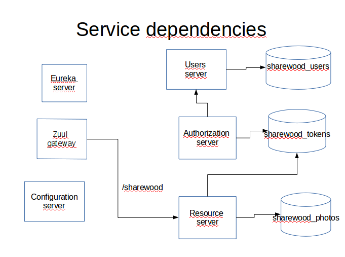
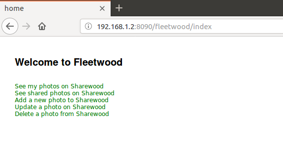
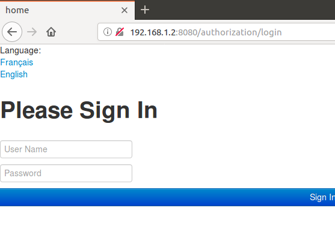
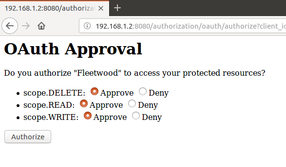

# sharewood-limehouse
I present here a microservice-oriented version of the previous project https://github.com/dubersfeld/sharewood-boot-oauth2. It uses Zuul as a reverse proxy and all servers run in Docker containers.

Here are the prerequisites for running the complete application:

Any Linux platform (I use Ubuntu 16.04)

A recent Apache Maven version installed (I use 3.3.9)

A recent Docker version installed (I use 17.12.1-ce)

In addition I used Spring Tool Suite for developing this demo but it is not required for running the application.

The complete application is comprised of an OAuth2 authorization server and an OAuth2 resource server. The resource server is hidden behind a reverse proxy. The authorization server is not.

A separate Eureka server is used to register the resource server.

An additional user server is used to provide user authentication needed for Authorization Code Grant.

A separate Spring Cloud configuration server sets all deployment configuration properties for the three servers and the gateway that all have spring-cloud-config-client dependency. It fetches properties from the local file system, not from a GitHub repository. All configuration YAML files are stored in the subdirectory config-repo.

Three separate databases are used to persist Oauth2 tokens, photos and users.

The dependencies are summarized on figure below:




Project name         | Application name | Port | Database                             | Routing
-------------------  | ---------------- | ---- | -------------------------------------| -------------------------
authorization-server | authorization    | 8080 | sharewood\_tokens                    |
sharewood-resource   | sharewood-server | 8081 | sharewood\_tokens, sharewood\_photos | sharewood
sharewood-config     |                  | 8888 |                                      |
sharewood-gateway    | zuul-service     | 5555 |                                      |
user-server          | users-service    | 9090 | sharewood\_users                     |
eureka-service       |                  | 8761 |                                      |

Here are the steps to run the application.

# 1. Databases creation

## 1.1. sharewood_photos
In folder docker/photos run the script photosBuild.sh then run the script photosVolume.sh.
It creates a volume named sharewood\_photos_db.
Run the command:
```
sudo docker exec -it photos_create /bin/bash
```
then enter:
```
mysql -u dbuser -p
```
on prompt enter password1234. Then the database sharewood_photos should be accessible inside the container:
 
```
mysql> SHOW DATABASES;
+--------------------+
| Database           |
+--------------------+
| information_schema |
| sharewood_photos   |
+--------------------+
2 rows in set (0.09 sec)
```

Exit from container and kill it with the command:
```
[sudo] docker rm -f photos_create
```

## 1.2. sharewood_users
In folder docker/users run the script usersBuild.sh then run the script usersVolume.sh.
It creates a volume named sharewood\_users_db.
Run the command:
```
sudo docker exec -it users_create /bin/bash
```
then enter:
```
mysql -u dbuser -p
```
on prompt enter password1234. Then the database sharewood_users should be accessible inside the container:
 
```
mysql> SHOW DATABASES;
+--------------------+
| Database           |
+--------------------+
| information_schema |
| sharewood_users   |
+--------------------+
2 rows in set (0.09 sec)
```

Exit from container and kill it with the command:
```
[sudo] docker rm -f users_create
```


## 1.3. sharewood_tokens

In folder docker/tokens edit the file sharewoodTokenDB.sql and in the line:
```
VALUES('Fleetwood', 'SHAREWOOD', '{bcrypt}$2a$10$xMgMQRCnrZ.vf/8WxyIwrOTiFKGJF72FYGxUjnSIWQMpFxFTtoU.2', 'READ,WRITE,DELETE', 'authorization\_code', 'http://192.168.1.2:8090/fleetwood/sharewood/photosMy,http://192.168.1.2:8090/fleetwood/sharewood/sharedPhotos,http://192.168.1.2:8090/fleetwood/sharewood/updatePhoto,http://192.168.1.2:8090/fleetwood/sharewood/deletePhoto,http://192.168.1.2:8090/fleetwood/sharewood/createPhotoMulti,http://192.168.1.2:8090/fleetwood/sharewood/getToken', 'ROLE_CLIENT', '520', null, '{}', null);
```
replace each occurence of '192.168.1.2' by the explicit (internal) IP address that matches your host.
 
Run the script tokensBuild.sh then run the script tokensVolume.sh.
It creates a volume named sharewood\_tokens_db.
Run the command:
```
sudo docker exec -it tokens_create /bin/bash
```
then enter:
```
mysql -u dbuser -p
```
on prompt enter password1234. Then the database sharewood_tokens should be accessible inside the container:
 
```
mysql> SHOW DATABASES;
+--------------------+
| Database           |
+--------------------+
| information_schema |
| sharewood_tokens   |
+--------------------+
2 rows in set (0.09 sec)
```

Exit from container and kill it with the command:
```
[sudo] docker rm -f tokens_create
```

In addition create a blank volume named sharewood\_photos\_store with the command:
```
[sudo] docker volume create sharewood\_photos\_store
```

# 2. Docker Spring images creation

In each project directory:
1. config-server
1. eureka-service
1. user-server
1. authorization-server
1. sharewood-resource
1. sharewood-gateway
1. fleetwood

run the Maven command:
```
[sudo] mvn clean package docker:build
```
This will create all the Spring Boot images except for sharewood resource that requires an additional step.
In folder docker/sharewood run the script sharewoodBuild.sh. I creates a new image named sharewood/sharewood populated with some photo JPG files. 

## 3. Launching the application

In directory docker run th command:

[sudo] docker-compose up

It will start all the servers in Docker containers.

## 4. Launching the client

In fleetwood directory run the command:
```
mvn spring-boot:run
```
to start the client. Then hit the browser using your explicit host IP address. With my host it is:

```
http://192.168.1.2:8090/fleetwood
```



The users server is populated with two users Alice and Carol who have the role USER. Their passwords are:
Alice: o8p7e6r5a
Carol: s1a2t3o4r

Now the user is presented the authentication page and approval page shown below. Note that the only port exposed is the proxy port 5555.




Note: it takes some time for the routes to be taken into account. The actual delay depends on the machine.

Once logged the user can execute all RESTful request after authenticating to the authorization server and granting to fleetwood the required scope. Note that all changes are persisted even if the servers are taken down for example by the command:
```
[sudo] docker-compose down
``` 

The most tricky part of this project was to force the correct redirection after a successful login to authentication-server. This is achieved by subclassing the beans AuthenticationSuccessHandler and ExceptionTranslationFilter in authentication-server.

Another point of interest is that the resource server connects to two different databases. This is achieved by creating a separate configuration class for each database and placing the relevant classes in two sepatrate packages.


